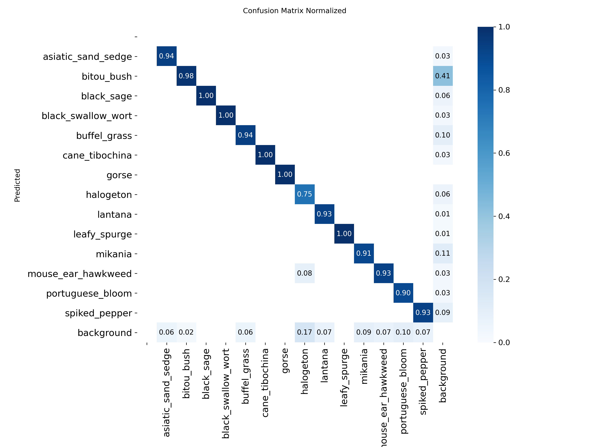
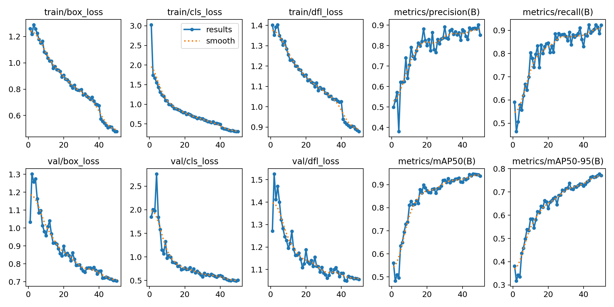

# Australian Invasive Plants dataset(AIP14)

This dataset contains 1,500 images of 14 most common invasive plants in Australia. Each category contains 100 images. All images are sampled from [iNaturalist.org](https://www.inaturalist.org/) with CC-BY-NC license, and are human-labelled for object detection jobs on YOLO family models.

### Structure

```
AIP14
└── images
    └── train(1,350)
    └── val(150)
└── labels
	└── train(1,350)
	└── val(150)
```

Although the dataset is shipped with a separation of training set and validation set, for industrial optimization use, you can mix all data samples together and re-separate with your own logic(e.g. K-Fold, etc.)

### About `negative`

For industrial optimization use, 100 **negative **samples are introduced into the dataset to reduce false positive rate. Label files for negative samples are blank. They can be safely removed if not needed.

### Example

Below is an example of finetuning YOLO v11m model.

```bash
Ultralytics 8.3.189  Python-3.10.16 torch-2.6.0+cu126 CUDA:0 (NVIDIA GeForce RTX 4070 Ti, 12282MiB)
YOLO11m summary (fused): 125 layers, 20,041,597 parameters, 0 gradients, 67.7 GFLOPs
                 Class     Images  Instances      Box(P          R      mAP50  mAP50-95): 100% ━━━━━━━━━━━━ 5/5 4.2it/s 1.2s
                   all        150        279      0.903      0.886      0.944      0.778
    asiatic_sand_sedge         10         17      0.882      0.882      0.921      0.666
            bitou_bush         10         61      0.845      0.892      0.932      0.749
            black_sage         10         10      0.982          1      0.995      0.706
    black_swallow_wort         10         23      0.919          1      0.992      0.867
          buffel_grass         10         17      0.926      0.824      0.908      0.591
        cane_tibochina         10         17      0.929          1      0.995      0.967
                 gorse         10         10          1      0.735      0.995      0.669
             halogeton         10         12       0.79       0.75      0.825      0.628
               lantana         10         30          1      0.824      0.969      0.782
          leafy_spurge         10         10      0.888          1      0.995      0.898
               mikania         10         22      0.817      0.909      0.948      0.893
    mouse_ear_hawkweed         10         15      0.868      0.933       0.94       0.88
      portuguese_bloom         10         20      0.974       0.85      0.947       0.79
         spiked_pepper         10         15      0.823        0.8      0.851        0.8
Speed: 1.5ms preprocess, 2.7ms inference, 0.0ms loss, 0.9ms postprocess per image
```

Below is the performance of the finetuning.





Box curves and training arguments are also provided in repo.

### Citation

```
@misc{yuan2025AIP14,
  title={Australian Invasive Plants dataset(AIP14)},
  author={Songwei Yuan},
  year={2025},
  url={https://github.com/1MLightyears/AIP14}
}
```

